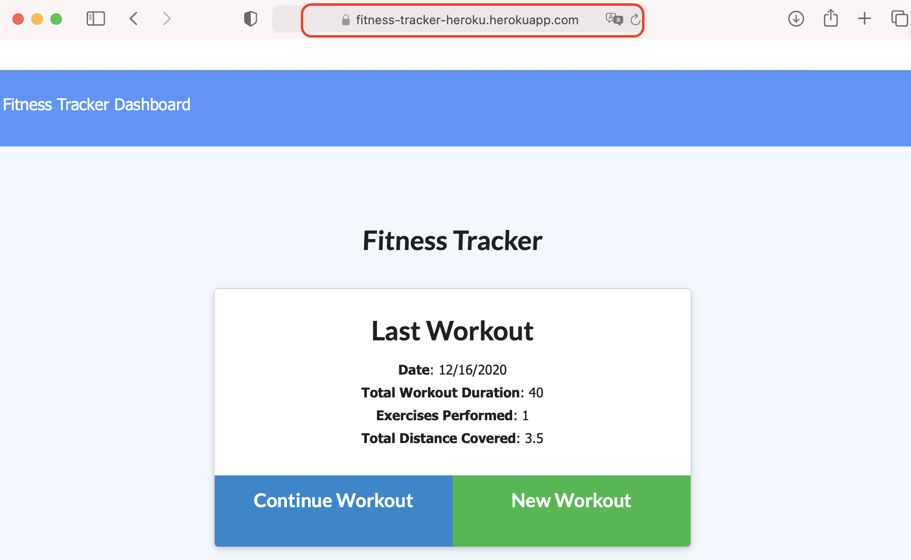

## Fitness_Tracker
## Table of Contents:
  - [Description](#description)
  - [User Story](#userstory)
  - [Installation](#installation)
  - [Run](#run)
  - [Deploy in Heroku](#deploy)
  - [Question](#question) 

### Description 
  Creating a workout tracker application, where will be to keep in  Mongo database with a Mongoose schema and handle routes with Express.

### <a name="userstory"></a>User Story
 As a user, I want to be able to view create and track daily workouts. I want to be able to log multiple exercises in a workout on a given day. I should also be able to track the name, type, weight, sets, reps, and duration of exercise. If the exercise is a cardio exercise, I should be able to track my distance traveled.

### Installation
[]()
```
Install MongoDB
```

### Run
```
* Run in Terminal: node server.js 
* Browser: http://localhost:3000/
```
### <a name="deploy"></a>Deploy in Heroku

https://fitness-tracker-heroku.herokuapp.com/?id=5fdacae34ff7380017ff2c79 

`Application run in the Heroku`


`Workout Dashboard displaying last weeks summary.` 


`Cluster in MongoDB`


### <a name="deploy"></a>Run in Localhost

`Home page`


`Workout Dashboard displaying last weeks summary.`


###  Question 
  For more questions about Team Profile Generator you can go to my Github page at the follow link: 

  - [GitHub Profile](https://github.com/adriana-carmo)
  - [GitHub Repo](https://github.com/adriana-carmo/Fitness_Tracker)

  For additional questions please reach out to my e-mail at : dri.abedala@gmail.com
